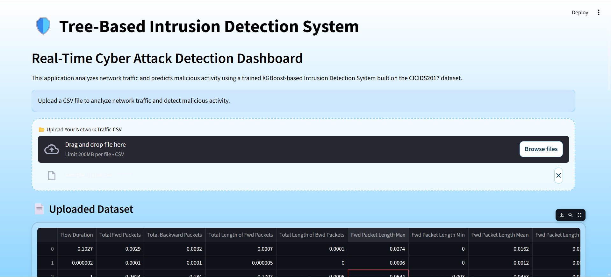
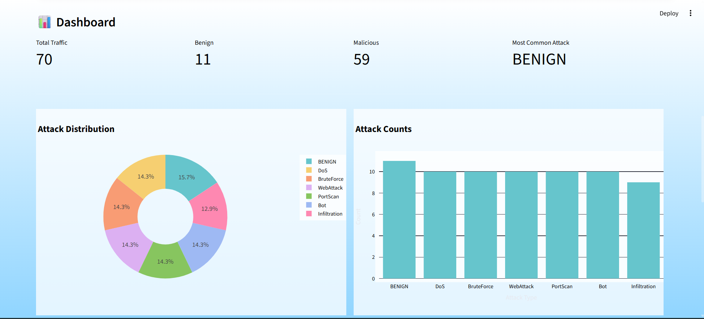
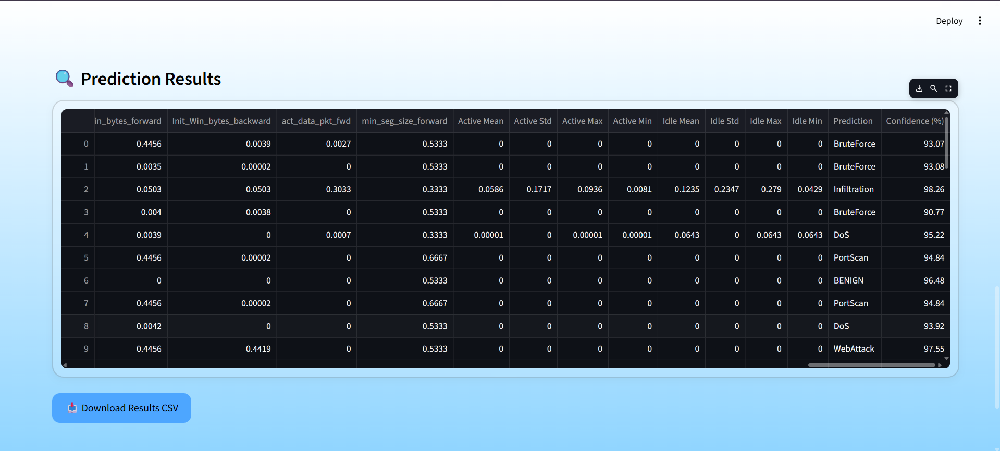

# 🛡️ Tree-Based Intrusion Detection System

A modern Machine Learning-based Intrusion Detection System (IDS) built using tree-based ensemble models and deployed with an interactive Streamlit dashboard for real-time cyber attack detection.

---

# 📌 Overview 

This project implements a **multi-phase Intrusion Detection System (IDS)** using classical and ensemble-based machine learning models trained on the **CICIDS2017 dataset**.

The system detects malicious network traffic and classifies multiple attack categories such as:

- DoS
- BruteForce
- WebAttack
- PortScan
- Bot
- Infiltration
- BENIGN traffic

The project follows a structured pipeline involving:

- Data preprocessing
- Feature selection
- SMOTE oversampling
- Tree-based model training
- Ensemble learning
- Real-time prediction dashboard using Streamlit

---

## ✨ Features

- Multi-class cyber attack detection
- Tree-based ML models
- Feature selection using importance ranking
- SMOTE oversampling for class balancing
- Ensemble learning architecture
- Interactive Streamlit dashboard
- CSV upload and prediction support
- Attack distribution visualizations
- Downloadable prediction results 

---

# 🧠 Machine Learning Pipeline

## Phase 1 — Baseline Model Training
Trained multiple tree-based models on the CICIDS2017 dataset:

- Decision Tree
- Random Forest
- XGBoost

---

## Phase 2 — Feature Selection + SMOTE
Improved model performance through:

- Feature importance ranking
- Top feature selection
- SMOTE oversampling for class imbalance handling

---

## Phase 3 — Ensemble Learning
Implemented stacked ensemble learning using:

### Base Models
- Decision Tree
- Random Forest
- XGBoost

### Meta Learner
- Logistic Regression

---

# 📊 Model Performance

| Model | Accuracy | Prediction Time (s) |
|---|---|---|
| Decision Tree | 99.55% | 0.0016 |
| Random Forest | 99.66% | 0.0706 |
| XGBoost | 99.45% | 0.0131 |
| Stacked Ensemble | **99.72%** | 0.1258 |

## 📂 Project Structure
## 📂 Project Structure

```text
Tree-Based-IDS/
│
├── app.py
├── README.md
├── requirements.txt
├── system_architecture.png
│
├── data/
│   ├── cicids2017.csv
│   ├── sample_input.csv
│   └── sample_input_predictions.csv
│
├── models/
│   ├── label_mapping.pkl
│   ├── selected_features.pkl
│   ├── stacking_ensemble_model.pkl
│   │
│   ├── phase1/
│   │   ├── decision_tree_model.pkl
│   │   ├── random_forest_model.pkl
│   │   └── xgboost_model.pkl
│   │
│   └── phase2/
│       ├── phase2_decision_tree_model.pkl
│       ├── phase2_random_forest_model.pkl
│       └── phase2_xgboost_model.pkl
│
├── notebooks/
│   └── ids_model_training.ipynb
│
└── results/
    ├── model_comparison_plots.png
    ├── model_results_phase2_with_time.csv
    ├── phase1_vs_phase2.csv
    │
    ├── phase1/
    ├── phase2/
    ├── phase3/
    └── UI/
        ├── home_ui.png
        ├── dashboard.png
        └── prediction_results.png
```
---

## 📊 Dataset
- **Dataset Used:** CICIDS2017  
- **Source:** [Canadian Institute for Cybersecurity](https://www.unb.ca/cic/datasets/ids-2017.html)  
- Contains both benign and multiple types of malicious network traffic.  
- Preprocessing steps included **label encoding** and **normalization**.

---

## 🛠️ Tools and Technologies
- **Languages:** Python 
- **Libraries:** NumPy, Pandas, Scikit-learn, XGBoost, Imbalanced-learn, Seaborn, Matplotlib, Joblib  
- **Development Tools:** Jupyter Notebook, VS Code, Google Colab

# 🖥️ Application Preview

## Home Interface



---

## Analytics Dashboard



---

## Prediction Results



## 🚀 How to Run
```bash
# Clone the repository
git clone https://github.com/Srilekha-0302/Tree-Based-IDS.git
cd Tree-Based-IDS

# Install dependencies
pip install -r requirements.txt

# Run Streamlit App
streamlit run app.py

